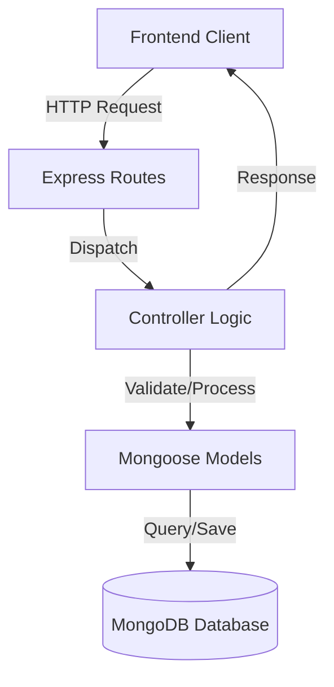

# Replate Backend Developer Documentation

## Table of Contents

1. [Introduction](#introduction)
2. [About the Project](#about-the-project)
3. [Installation](#installation)
4. [Usage](#usage)
5. [Running Tests](#running-tests)
6. [Compatibility](#compatibility)
7. [Project Structure Overview](#project-structure-overview)
8. [Security Design Notes](#security-design-notes)
9. [Limitations](#limitations)
10. [Project Support](#project-support)
11. [License](#license)

## Introduction

Welcome to the backend documentation for **FoodShare/Replate**. This repository contains the server-side API application built with Node.js, Express.js, and MongoDB. It handles data persistence, authentication, and business logic for connecting food donors, NGOs, and volunteers.

## About the Project

 The backend architecture uses a **Model-Controller-Service** pattern to ensure separation of concerns and maintainability.

### Architecture Diagram


### Technology Stack
*   **Runtime**: Node.js (v16+)
*   **Framework**: Express.js
*   **Database**: MongoDB (Mongoose ODM)
*   **Authentication**: JWT (JSON Web Tokens)
*   **Security**: `bcryptjs` (Hashing), `cors`, `helmet` (suggested)
*   **Testing**: Jest, Supertest

## Installation

### Prerequisites
*   [Node.js](https://nodejs.org/) installed
*   [MongoDB](https://www.mongodb.com/) installed and running locally OR a MongoDB Atlas connection string.

### Steps
1.  **Clone the Repository**
    ```bash
    git clone <repository-url>
    cd replate-backend
    ```

2.  **Install Dependencies**
    ```bash
    npm install
    ```

3.  **Environment Configuration**
    Create a `.env` file in the root directory:
    ```env
    # Server Configuration
    PORT=5001
    NODE_ENV=development

    # Database Connection
    MONGODB_URI=mongodb://127.0.0.1:27017/foodshare

    # Security
    JWT_SECRET=your_super_secret_key_change_in_production
    JWT_EXPIRE=30d
    ```

## Usage

### Running the Application

*   **Development Mode** (with hot-reloading):
    ```bash
    npm run dev
    ```
    *Server starts on port 5001 by default.*

*   **Production Mode**:
    ```bash
    npm start
    ```

### API Endpoints Overview
A detailed Postman collection is available in `Replate_API_Collection.postman_collection.json`.

*   **Authentication**: `/api/auth` (Register, Login)
*   **User Management**: `/api/users` (Profile management)
*   **Donations**: `/api/donations` (Create, List, View History)
*   **Requests**: `/api/requests` (Manage food requests)
*   **Assignments**: `/api/assignments` (Volunteer pickups)

## Running Tests

We use a combination of automated testing and manual API testing.

### Automated Tests (Jest)
Located in `test/` directory.

*   **Run all tests**:
    ```bash
    npm test
    ```
*   **Watch mode**:
    ```bash
    npm test -- --watch
    ```

### API Testing (Postman)
Import `Replate_API_Collection.postman_collection.json` into Postman to test endpoints manually against `localhost:5001`.

## Compatibility

*   **Node.js**: v14.x, v16.x, v18.x recommended.
*   **MongoDB**: v4.4 or higher.
*   **OS**: Cross-platform (Windows, macOS, Linux).

## Project Structure Overview

| Directory | Description |
| :--- | :--- |
| `config/` | Database connection logic (`db.js`). |
| `controllers/` | Request handling logic (e.g., `authController.js`). |
| `middleware/` | Custom middleware (Auth `auth.js`, Validation). |
| `models/` | Mongoose schemas (`User.js`, `Donation.js`). |
| `routes/` | API route definitions used by Express. |
| `scripts/` | Utility scripts (e.g., seeding data). |
| `test/` | Automated test suites. |
| `server.js` | Application entry point. |

## Security Design Notes

*   **Password Hashing**: User passwords are encrypted using `bcryptjs` before storage.
*   **JWT Auth**: Stateless authentication using JSON Web Tokens.
*   **Input Validation**: Request bodies are validated using `express-validator` to prevent malformed data.
*   **Protected Routes**: Middleware ensures only authorized users can access sensitive endpoints.

## Limitations

*   **Rate Limiting**: Not currently implemented; recommended for production to prevent abuse.
*   **Session Management**: Purely stateless via JWT; no server-side token revocation list (blacklisting) currently active.

## Project Support

For issues, feature requests, or contributions, please open an issue in the repository.

## License

This project is licensed under the MIT License - see the LICENSE file for details.
