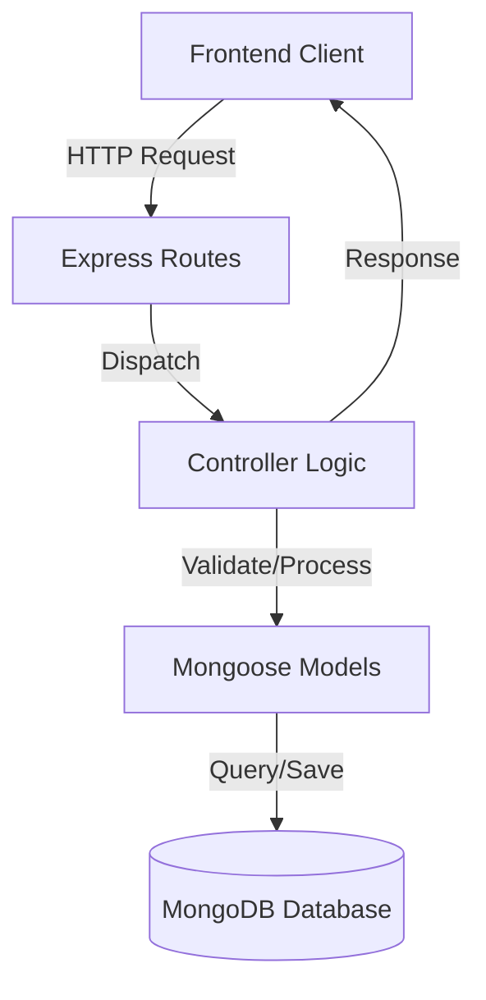

# Replate Backend Developer Documentation

This repository contains the backend API for the FoodShare/Replate application, a platform connecting food donors with NGOs and volunteers. The backend is built using Node.js, Express.js, and MongoDB.

## 🏗️ Architecture

The application follows a **Model-Controller-Service** pattern (though services may be integrated into controllers for simpler logic).



## 🛠️ Technology Stack

-   **Runtime**: Node.js (v16+)
-   **Framework**: Express.js
-   **Database**: MongoDB (Mongoose ODM)
-   **Authentication**: JWT (JSON Web Tokens)
-   **Security**: bcryptjs (Hashing), cors (Cross-Origin Resource Sharing)
-   **Validation**: express-validator
-   **Testing**: Jest, Supertest
-   **Development**: Nodemon (Hot reloading)

## 📋 Prerequisites

-   [Node.js](https://nodejs.org/) installed
-   [MongoDB](https://www.mongodb.com/) installed and running locally OR a MongoDB Atlas connection string.

## 🚀 Getting Started

### 1. Clone the Repository

```bash
git clone <repository-url>
cd replate-backend
```

### 2. Install Dependencies

```bash
npm install
```

### 3. Environment Configuration

Create a `.env` file in the root directory. You can copy the structure below:

```env
# Server Configuration
PORT=5001
NODE_ENV=development

# Database Connection
MONGODB_URI=mongodb://127.0.0.1:27017/foodshare

# Security
JWT_SECRET=your_super_secret_key_change_in_production
JWT_EXPIRE=30d
```

### 4. Running the Application

**Development Mode** (with hot-reloading):

```bash
npm run dev
```
*The server will start on port 5001 by default.*

**Production Mode**:

```bash
npm start
```

## 🧪 Testing

We use a combination of automated testing and manual API testing to ensure code quality.

### 1. Automated Tests (Jest)
The project includes a suite of unit and integration tests found in the `test/` directory.

-   **Run all tests**:
    ```bash
    npm test
    ```
-   **Run tests in watch mode** (for development):
    ```bash
    npm test -- --watch
    ```

### 2. API Testing (Postman)
Manual API testing is performed using Postman. A comprehensive collection file is included in the root directory.

-   **File**: `Replate_API_Collection.postman_collection.json`
-   **Method**: Import into Postman, configure environment (localhost:5001), and run requests against the local server.

This covers key flows: Auth, Donations, Requests, and Assignments.

## 📂 Project Structure

| Directory | Purpose |
| :--- | :--- |
| `config/` | Database connection logic (`db.js`) |
| `controllers/` | Logic for handling API requests (e.g., `authController.js`) |
| `middleware/` | Custom middleware (Authentication `auth.js`, Validation) |
| `models/` | Mongoose schemas (`User.js`, `Donation.js`) |
| `routes/` | API route definitions (`auth.js`, `donation.js`) |
| `scripts/` | Utility scripts (e.g., database seeding) |
| `test/` | Automated test files |
| `server.js` | Application entry point |

## 📡 API Endpoints

A complete Postman collection is included in the repo: `Replate_API_Collection.postman_collection.json`.

### Authentication (`/api/auth`)
-   `POST /register`: Register a new user (Donor, NGO, Volunteer)
-   `POST /login`: Authenticate user and get Token

### User Management (`/api/users`)
-   `GET /me`: Get current user profile
-   `PUT /me`: Update profile details

### Donations (`/api/donations`)
-   `POST /`: Create a new donation (Donor)
-   `GET /`: List available donations (NGO)
-   `GET /my-donations`: List donor's own history

### Requests (`/api/requests`)
-   `POST /`: Request a specific donation (NGO)
-   `GET /my-requests`: View status of requests

### Assignments (`/api/assignments`)
-   `GET /available`: View pending pickups (Volunteer)
-   `POST /accept/:id`: Accept a pickup task
-   `PUT /:id/status`: Update status (Picked Up -> Delivered)

## 🔒 Security Features

-   **Password Hashing**: User passwords are encrypted using `bcryptjs` before storage.
-   **JWT Auth**: Stateless authentication using JSON Web Tokens.
-   **Input Validation**: Request bodies are validated using `express-validator` to prevent malformed data.
-   **Protected Routes**: Middleware ensures only authorized users can access sensitive endpoints.

## 🤝 Contributing

1.  Fork the repository
2.  Create your feature branch (`git checkout -b feature/NewFeature`)
3.  Commit your changes (`git commit -m 'Add some NewFeature'`)
4.  Push to the branch (`git push origin feature/NewFeature`)
5.  Open a Pull Request
