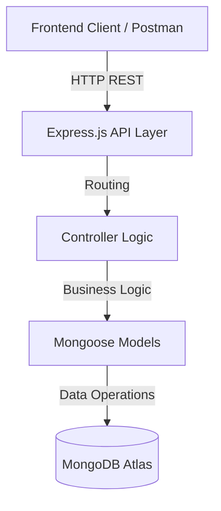

# Replate - Food Redistribution Platform (Backend)

This repository contains the backend API for **Replate**, handling data persistence, authentication, and core business logic for the food redistribution ecosystem.

---

## 🛠️ DevOps & Developer Documentation (DevDocs)

### 1. Introduction
The **Replate Backend** is a RESTful API service built with Node.js and Express. It acts as the central hub connecting donors, NGOs, and volunteers. It manages user accounts, donation tracking, logistics assignments, and impact analytics, ensuring a reliable and secure experience for all stakeholders.

### 2. System Architecture
The backend follows the **Model-View-Controller (MVC)** pattern to ensure scalability and ease of testing. It utilizes MongoDB for flexible, document-based data storage.


```mermaid
graph TD
    Client[Frontend Client / Postman] -->|HTTP REST| API[Express.js API Layer]
    API -->|Routing| Controllers[Controller Logic]
    Controllers -->|Business Logic| Models[Mongoose Models]
    Models -->|Data Operations| DB[(MongoDB Atlas)]
```

*   **Data Layer**: Mongoose ODM for schema definition and validation.
*   **Auth Layer**: Stateless JWT-based authentication.

### 3. Technology Stack
*   **Runtime**: Node.js
*   **Framework**: Express.js
*   **Database**: MongoDB (Mongoose)
*   **Security**: bcryptjs (Hashing), JSON Web Token (JWT)
*   **Middleware**: CORS, Express-Validator
*   **Testing**: Jest, Supertest

### 4. Repository Structure
The Replate Backend follows a clean separation of concerns using the Controller-Service-Model pattern.

#### 📂 Directory Tree
```text
replate-backend/
├── config/                 # Infrastructure setup (Database connection)
├── controllers/            # Business logic handlers for all API modules
│   ├── adminController.js     # User management & platform-wide stats
│   ├── donationController.js  # Donation lifecycles (pending -> delivered)
│   └── impactController.js   # Sustainability score calculations
├── middleware/             # Request interceptors (Auth protection, Admin-only)
├── models/                 # Mongoose Data Schemas (User, Donation, Assignment)
├── routes/                 # Express REST endpoint definitions
├── scripts/                # Maintenance tools (Inventory cleanup, Cron jobs)
├── utils/                  # Helper utilities (Coordinate distance calculators)
├── server.js               # Application entry point & configuration
└── Replate_API_Collection.json # Postman integration file
```

#### 🏗️ Logic & Data Modules
| Module | Components Involved | Responsibility |
| :--- | :--- | :--- |
| **Authentication** | `authController`, `User` model, `auth` middleware | Registration, Login, and JWT Token validation. |
| **Logistics** | `assignmentController`, `requestController` | Managing volunteer-food-NGO connections and routing. |
| **Impact** | `impactController`, `Donation` model | Real-time tracking of CO2 reduction and meals saved. |
| **Notifications** | `notificationController` | Real-time alerts for donors and NGOs. |

### 5. CI/CD Pipeline
*   **Quality Assurance**: Automated testing using **Jest** and **Supertest** ensures that every API endpoint returns expected results before deployment.
*   **Automated Deployment**:
    1. Developers push code to the `main` branch.
    2. **Render** (Cloud Platform) detects the push via Webhooks.
    3. The build process installs dependencies and starts the server.
    4. Health checks verify the application is running before routing production traffic.

### 6. Local Development Setup
To run the API server locally:

1. **Prerequisites**: Install [Node.js](https://nodejs.org/) and have access to a [MongoDB](https://www.mongodb.com/) instance.
2. **Installation**:
   ```bash
   npm install
   ```
3. **Environment**: Configure `.env` with the following:
   ```env
   PORT=5000
   MONGODB_URI=your_mongodb_connection_string
   JWT_SECRET=your_secret_key
   ```
4. **Execution**:
   - `npm run dev`: Starts the server with hot-reloading (via nodemon).
   - `npm start`: Standard production startup.

### 7. Deployment Process
The system is optimized for cloud deployment (e.g., Render, AWS, or Heroku):
1. **Branch Management**: All production-ready code is merged into the `main` branch.
2. **Environment Variables**: Confidential keys (DB URI, JWT secret) are injected via the hosting platform's environment manager.
3. **Build & Release**: The platform executes `npm install` followed by `npm start`, with automated rollback capabilities if deployment fails.

### 8. Monitoring & Logging
*   **Platform Dashboard**: Real-time traffic monitoring and CPU/Memory usage via the **Render** dashboard.
*   **Database Insights**: Query performance and storage limits tracked through **MongoDB Atlas**.
*   **Application Logs**: Detailed runtime logs captured for debugging and traffic analysis.

### 9. Security Considerations
*   **Encryption**: All user passwords are irreversibly hashed using `bcryptjs` before storage.
*   **Stateless Security**: JWT authentication ensures that no session data is stored on the server, enhancing scalability and security.
*   **Input Sanitization**: Use of `express-validator` to prevent SQL/NoSQL injection and malformed data entries.
*   **CORS**: Restricted access to prevent unauthorized domains from interacting with the API.

---

## License
Licensed under the ISC License.
